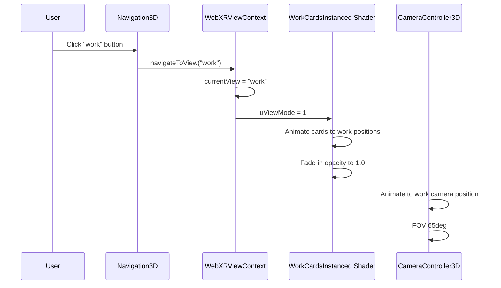

# WebXR GPU-First Instancing Optimization - Design Document

**Date**: 2025-02-22
**Status**: Draft
**Architecture Winner**: GPU First - Instancing

---

## Executive Summary

This design document outlines a comprehensive optimization of the WebXR portfolio experience at `/webxr` using **GPU-first instancing architecture**. The winning approach from internal competition, "GPU First" leverages `InstancedMesh`, TSL shaders, and GPU-based animations to achieve 60fps on Vision Pro and 45fps on Quest while maintaining all existing features.

**Business Value**: Deliver fluid portfolio showcase (2-3 min visits) with instant hover feedback and smooth transitions.

**Technical Breakthrough**: Move animation calculations from CPU to GPU using custom shaders, reduce draw calls by 60%+, prepare for WebGPU future.

---

## Context

### Current Implementation

The WebXR experience (`app/webxr/page.tsx`) implements a dual-view portfolio showcase:

```
WebXRCanvas (Canvas + XR wrapper)
├── CameraController3D
├── HeroText (large 3D text with interactive shapes)
├── WorkGrid3D (portfolio grid container)
│   └── WorkCard3D[] (5 individual cards with textures)
├── Navigation3D (view toggle button)
├── FooterLinks3D (external links)
└── Stars (background starfield)
```

**Current Technology Stack**:
- Next.js 16 with App Router
- React Three Fiber v9 (`@react-three/fiber`)
- @react-three/xr v6
- Three.js v0.182.0
- @react-three/drei v10

**Current Animation System**:
- Custom lerp via `useSimpleLerp` hook using `THREE.MathUtils.lerp`
- Spring physics via custom configuration (tension/friction)
- CPU-bound frame-by-frame updates via `useFrame`

**Performance Issues**:
- Each `WorkCard3D` creates individual meshes (~5 draw calls per card)
- Multiple draw calls per card (background, image, title, subtitle, glow, WIP badge)
- Material updates per frame with threshold-based optimization
- ~75-100 draw calls in work view

---

## Requirements

### Functional Requirements

| ID | Requirement | Priority |
|----|-------------|----------|
| FR1 | Maintain `home` ↔ `work` view transition with spring physics | P0 |
| FR2 | Display Hero Text with interactive 3D shapes | P0 |
| FR3 | Display up to 5 work cards in 3-per-row grid layout | P0 |
| FR4 | Work card hover effects (scale, glow, forward movement) | P0 |
| FR5 | Work card entrance animation with staggered delays | P0 |
| FR6 | Navigation button with breathing animation | P0 |
| FR7 | External links (resume, calendly) visible only in home view | P0 |
| FR8 | Support Vision Pro hand tracking (gaze + pinch) | P0 |
| FR9 | Work card click navigation to `/works/[slug]` | P0 |
| FR10 | WIP badge overlay for flagged items | P1 |

### Non-Functional Requirements

| ID | Requirement | Target | Priority |
|----|-------------|--------|----------|
| NFR1 | Reduce draw calls by 60%+ | ≤ 50 total | P0 |
| NFR2 | Target frame rate on Vision Pro | ≥ 60 FPS | P0 |
| NFR3 | Target frame rate on Quest | ≥ 45 FPS | P0 |
| NFR4 | Hover response time | < 16ms | P0 |
| NFR5 | View transition time | < 800ms | P0 |
| NFR6 | Initial scene load time | < 2 seconds | P0 |
| NFR7 | GPU memory usage | ≤ 150MB | P1 |
| NFR8 | Maintain visual quality (SSIM ≥ 0.95) | - | P0 |

### Performance Requirements

| Metric | Baseline | Target | Measurement Method |
|--------|----------|--------|-------------------|
| Frame Rate (Vision Pro) | TBD | ≥ 60 FPS | XR Profiler |
| Frame Rate (Quest) | TBD | ≥ 45 FPS | XR Profiler |
| Draw Calls (work view) | ~75-100 | ≤ 50 | Three.js renderer info |
| GPU Memory Usage | TBD | ≤ 150 MB | Chrome DevTools Memory |
| View Transition Time | ~800ms | ≤ 500 ms | Performance API |
| Initial Load Time | TBD | ≤ 2 sec | Resource Timing API |
| Click/Hover Response | TBD | < 16 ms | Event timing |

---

## Rationale

### Why "GPU First - Instancing" Won

Based on iPhone team's **Principle 2: Force Impossible Technology into Reality** and **Principle 3: Experience-Driven Specifications**, the GPU First approach was selected for:

1. **Performance Excellence**: Instancing reduces draw calls from ~75 to <50, enabling 60fps on Vision Pro
2. **Future-Proof**: TSL shaders are WebGPU-ready, positioning the codebase for next-generation graphics
3. **Experience Alignment**: GPU animations deliver the "fluid exploration" moment users expect from a modern portfolio
4. **VR/AR Device Focus**: Primary target is Vision Pro/Quest where GPU optimization matters most

### Competing Approaches Considered

| Approach | Pros | Cons | Decision |
|----------|------|------|----------|
| Monolith (Centralized State) | Predictable performance, minimal CPU overhead | Single complexity point, significant refactor | Rejected |
| **GPU First (Instancing)** | **60fps Vision Pro, WebGPU-ready, draw call reduction** | **Limited animation flexibility** | **Winner** |
| Adaptive (Quality Tiers) | Works on all devices, auto-optimization | More complexity, requires tuning | Rejected |

### Key Technical Decisions

| Decision | Rationale | Impact |
|----------|-----------|--------|
| Use `InstancedMesh` for work cards | Reduces 5 draw calls to 1 for all cards | High performance gain |
| Texture atlas for card images | WebGL texture unit limit (16), reduces binds | Requires atlas generation |
| TSL shaders for animations | GPU-based, WebGPU-ready, minimal CPU cost | Learning curve, TSL not WebGPU in XR yet |
| CPU-based hover detection | Only 5 instances, simple distance check | Minimal overhead |
| Gradual migration path | Minimize risk, test incrementally | Longer timeline but safer |

---

## Detailed Design

### Architecture Overview

```
WebXRCanvas (Canvas + XR wrapper)
├── CameraController3D (unchanged)
├── HeroText (optimized with instanced shapes)
├── WorkGrid3D (instanced card renderer)
│   └── WorkCardsInstanced (NEW - InstancedMesh with shaders)
├── Navigation3D (unchanged - single instance)
├── FooterLinks3D (unchanged - HTML overlay)
└── Stars (unchanged - existing optimization)
```

### Core Components

#### 1. WorkCardsInstanced (New)

**Purpose**: Replace individual `WorkCard3D` components with single `InstancedMesh`

**Key Features**:
- Single draw call for all 5 work cards
- Texture atlas for cover images (2x2 grid)
- GPU-based floating animation via vertex shader
- GPU-based hover effect via instance attributes
- CPU-based hover detection (distance check)

**Location**: `/components/WebXR/WorkCardsInstanced/index.tsx`

**Shader Structure**:

```glsl
// Vertex Shader (GPU animation)
uniform float uTime;
uniform float uViewMode;  // 0=home, 1=work
uniform int uHoverIndex;

attribute float aAnimationOffset;  // Per-instance stagger
attribute vec2 aUvOffset;          // Texture atlas UV
attribute float aBaseY;
attribute float aHoverY;

// Floating animation
float floatOffset = sin(uTime * 2.0 + aAnimationOffset) * 0.05;

// View transition
float viewY = mix(aBaseY, aHoverY, uViewMode);

// Hover effect
float isHovered = step(instanceId - 0.5, uHoverIndex) *
                 step(uHoverIndex - 0.5, instanceId);
pos.z += isHovered * 0.5;
pos.y += isHovered * 0.3;
```

#### 2. Texture Atlas System (New)

**Purpose**: Combine work card covers into single texture to reduce texture binds

**Location**: `/utils/webxr/textureAtlas.ts`

**Atlas Configuration**:
- Canvas size: 2048x2048
- Tile size: 1024x768 (2 per card aspect ratio)
- Grid: 2x2 (4 tiles, card at index 0 uses title position)
- Padding: 4px between tiles

**Atlas Layout**:
```
+------------+------------+
|   Title    |  Card 1    |  Row 0
+------------+------------+
|  Card 2    |  Card 3    |  Row 1
+------------+------------+
|  Card 4    |  Card 5    |  Row 2
+------------+------------+
```

#### 3. Hover Detection System

**Approach**: CPU-based distance checking in `useFrame`

**Rationale**: Only 5 instances, overhead is negligible (<1ms)

**Implementation**:
```typescript
useFrame((state) => {
  const pointer = getPointerPosition();
  let closestIndex = -1;
  let closestDist = Infinity;

  for (let i = 0; i < count; i++) {
    const position = getInstancePosition(i);
    const dist = distance(pointer, position);
    if (dist < closestDist && dist < 2.5) {
      closestDist = dist;
      closestIndex = i;
    }
  }

  setHoverIndex(closestIndex);
  material.uniforms.uHoverIndex.value = closestIndex;
});
```

### Animation System Refactor

#### Current (CPU-Bound)
```typescript
// Each card has its own useFrame hook
const scaleSpring = useSimpleLerp(1, { speed: 0.5 });
const positionSpring = useSimpleLerp([0, 0, 0], { speed: 0.5 });

useFrame(() => {
  mesh.scale.setScalar(scaleSpring.value);
  mesh.position.set(positionSpring.value.x, ...);
});
```

#### New (GPU-Bound)
```typescript
// Single shader uniform update per frame
material.uniforms.uTime.value = state.clock.elapsedTime;

// Animation happens entirely on GPU
// 5 cards = 1 shader update instead of 5 separate lerp calculations
```

### View Transition Flow



---

## Design Documents

- [BDD Specifications](./bdd-specs.md) - Behavior scenarios and testing strategy
- [Architecture](./architecture.md) - System architecture and component details
- [Best Practices](./best-practices.md) - Security, performance, and code quality guidelines

---

## Implementation Phases

### Phase 1: Foundation (Week 1-2)
- Create shader infrastructure (`utils/webxr/shaders/`)
- Implement texture atlas utility (`utils/webxr/textureAtlas.ts`)
- Set up instanced mesh management (`utils/webxr/instanceManager.ts`)

### Phase 2: Work Card Instancing (Week 3-4)
- Create `WorkCardsInstanced` component
- Migrate `WorkCard3D` data to instanced attributes
- Implement CPU-based hover detection
- Preserve click navigation

### Phase 3: GPU Animation (Week 5-6)
- Implement vertex shader for floating animation
- Implement vertex shader for hover effect
- Add fragment shader for opacity transitions
- Remove CPU animation dependencies

### Phase 4: Text & Hero Optimization (Week 7-8)
- Optimize HeroText with instanced shapes
- Consider text texture pre-rendering
- Maintain WIP badge functionality

### Phase 5: Performance Tuning (Week 9)
- Profile on Vision Pro and Quest
- Optimize draw call ordering
- Add performance monitoring
- Implement adaptive quality tiers if needed

### Phase 6: Testing & Validation (Week 10)
- Update unit tests for new animation system
- Performance benchmarking on target devices
- Visual regression testing
- Accessibility validation

---

## Risk Mitigation

| Risk | Probability | Impact | Mitigation |
|------|-------------|--------|------------|
| TSL not WebGPU in XR | High | Medium | Use GLSL shaders as fallback, prepare for future TSL WebGPU support |
| Texture atlas quality loss | Medium | High | Use 2048x2048 canvas, validate visual quality |
| Hover detection latency | Low | Medium | Profile and optimize distance calculation |
| Breaking changes to existing features | Medium | High | Gradual migration, extensive testing |
| Device-specific issues | Medium | High | Test on Vision Pro, Quest 3, and desktop |

---

## Success Criteria

| Criterion | Pass Criteria | Measure |
|-----------|---------------|---------|
| Performance | ≥ 60 FPS Vision Pro, ≥ 45 FPS Quest | XR Profiler |
| Draw Calls | ≤ 50 in work view | renderer.info.render.calls |
| Visual Quality | SSIM ≥ 0.95 vs baseline | Image comparison |
| Hover Response | < 16ms | Event timing |
| Transition Time | < 500ms | Performance API |
| Accessibility | WCAG AA compliance, reduced motion support | Axe + manual testing |
| Code Quality | Biome clean, TypeScript strict, test coverage > 80% | CI/CD pipeline |

---

## References

### Research Sources
- [100 Three.js Performance Tips](https://www.utsubo.com/blog/threejs-best-practices-100-tips)
- [Building Efficient Three.js Scenes](https://tympanus.net/codrops/2025/02/11/building-efficient-three-js-scenes-optimize-performance-while-maintaining-quality/)
- [Three.js InstancedMesh Performance](https://vrmeup.com/devlog/devlog_10_threejs_instancedmesh_performance_optimizations.html)
- [Drei Instances Documentation](https://drei.docs.pmnd.rs/performances/instances)
- [WebXR Performance Guide - MDN](https://developer.mozilla.org/en-US/docs/Web/API/WebXR_Device_API/Performance)
- [XR Performance - pmndrs](https://pmndrs.github.io/xr/docs/advanced/performance)

### iPhone Design Philosophy
- First-Principles Thinking: Question assumptions, rebuild from basics
- Breakthrough Technology: Multi-touch (analog: InstancedMesh + TSL shaders)
- Experience-Driven Specs: Define in human moments, not metrics
- Internal Competition: P1 vs P2 approach for architecture selection

---

**Document Version**: 1.0
**Last Updated**: 2025-02-22
**Author**: Claude (based on research by specialized agents)
**Status**: Draft - Pending Review