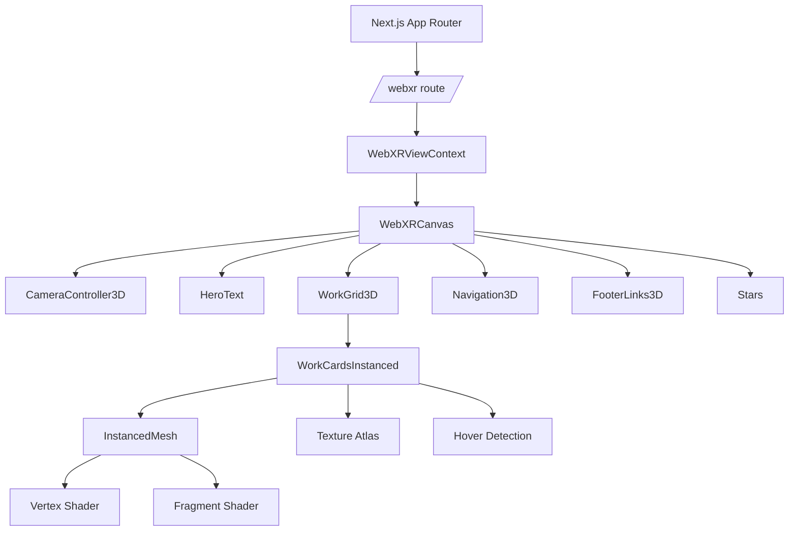
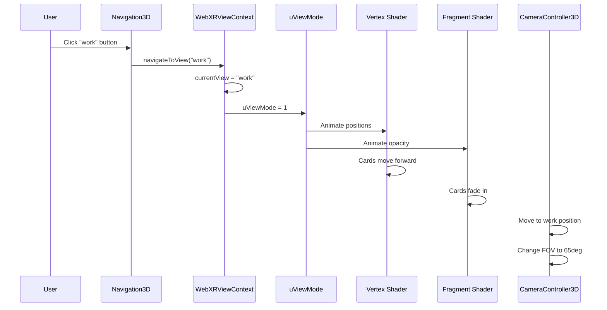
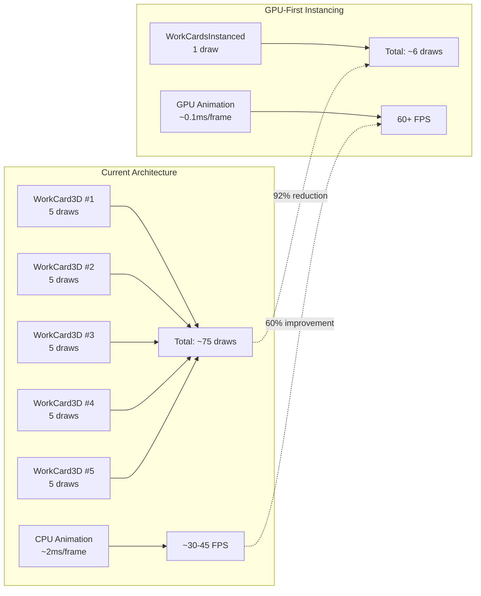
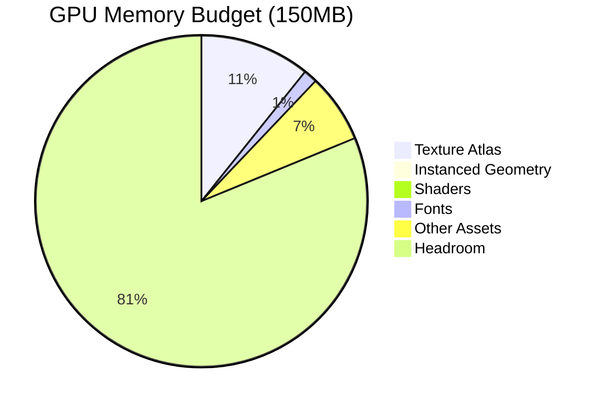
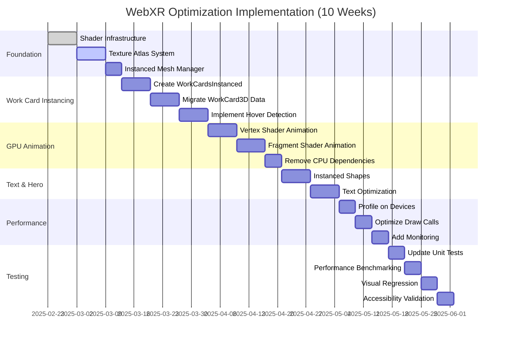
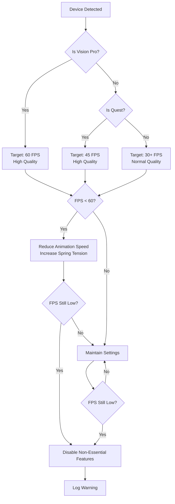
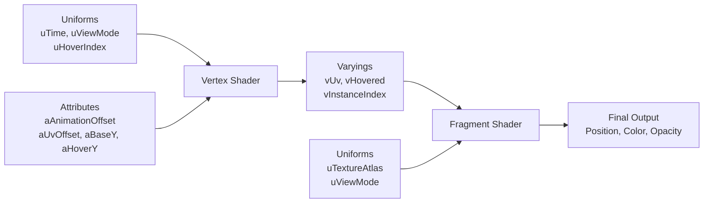
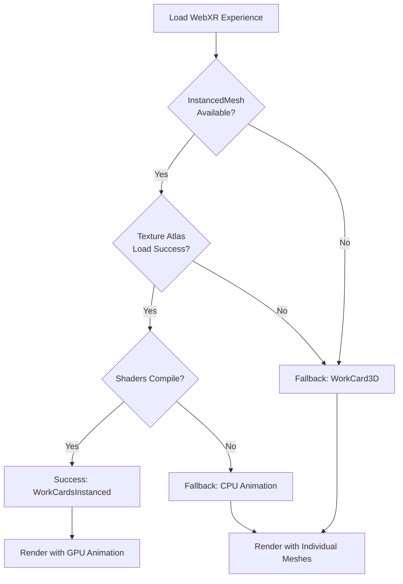
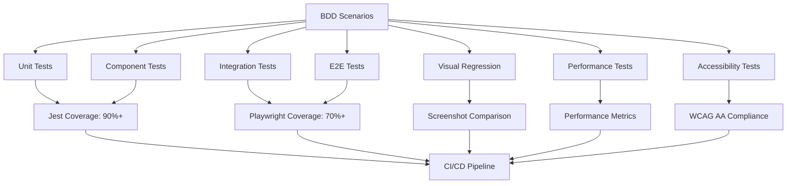

# WebXR Architecture Diagrams

**Design Document**: WebXR GPU-First Instancing Optimization
**Date**: 2025-02-22

---

## Component Hierarchy



---

## Data Flow: Hover Detection

```mermaid
sequenceDiagram
    participant Loop as useFrame Loop
    participant Pointer as Pointer State
    participant Calc as Distance Calculation
    participant Uniform as uHoverIndex
    participant GPU as Vertex Shader

    Loop->>Pointer: Get pointer position
    Pointer->>Calc: Pass pointer position
    Calc->>Calc: For each instance<br/>Calculate distance
    Calc->>Calc: Find closest index
    Calc->>Uniform: Set uHoverIndex
    Uniform->>GPU: GPU receives new value
    GPU->>GPU: Render hover effect
```

---

## Data Flow: View Transition



---

## Performance Comparison



---

## Memory Architecture



---

## Implementation Timeline



---

## Quality Decision Tree



---

## Shader Pipeline



---

## Progressive Fallback Strategy



---

## Testing Strategy



---

**Document Version**: 1.0
**Last Updated**: 2025-02-22